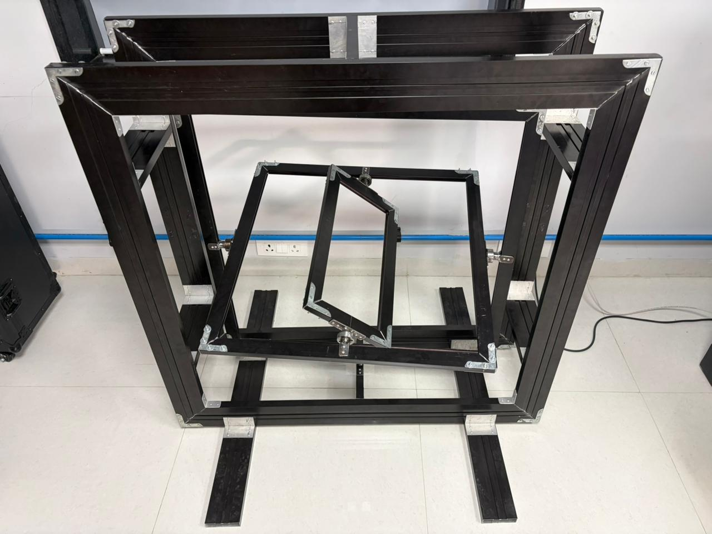
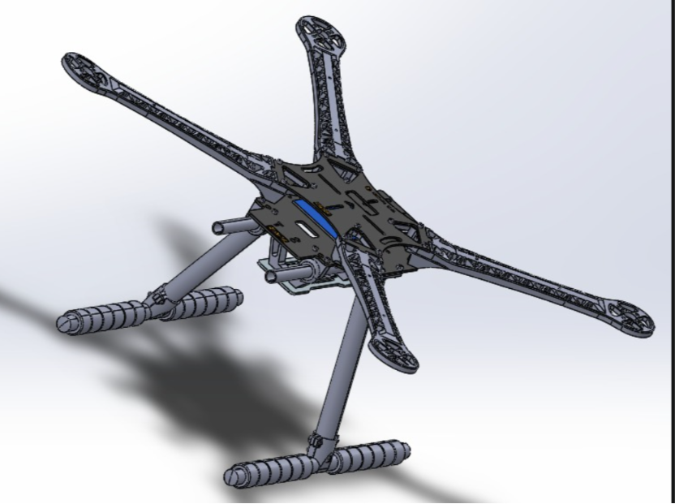
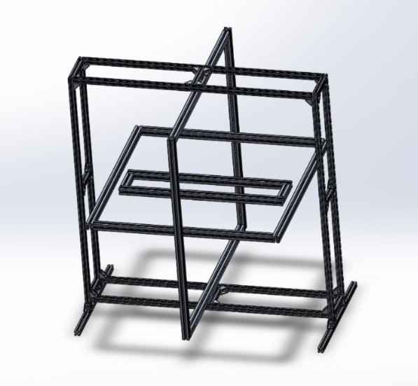

# Design of FPV Quadcopter Flight Controller with Drone Test Rig

## Overview

This project focuses on the design and development of an **FPV quadrotor flight controller integrated with a 3-DOF drone test rig** for safe testing and analysis of drone stability, control response, and dynamic behaviour.

The drone test rig provides a controlled environment by restricting translational motion while allowing rotational movement along three axes: **Roll, Pitch, and Yaw**. This enables testing and tuning of flight control algorithms without the risks associated with free-flight experiments.

---

# Project Objectives

- Design and implement an FPV quadrotor flight controller.
- Develop a three-axis drone test rig for controlled flight analysis.
- Analyse drone stability and dynamic response.
- Implement sensor data processing and control algorithms.
- Provide a safe platform for PID tuning and flight controller testing.

---

# System Architecture

The complete system consists of:
FPV Transmitter
|
↓
Receiver
|
↓
Flight Controller (Teensy 4.0)
|
↓
PID Controller
|
↓
ESCs
|
↓
BLDC Motors
|
↓
Propellers
|
↓
Drone Test Rig

---

# Hardware Components

## Flight Controller System

| Component | Description |
|---|---|
| Teensy 4.0 | Main flight controller |
| MPU9250 IMU | 9-axis motion sensing unit |
| BLDC Motors | Drone propulsion system |
| ESC | Motor speed control |
| FlySky FS-CT6B | RC transmitter and receiver |
| FPV Quadcopter Frame | Drone structure |

---

## Drone Test Rig

The developed test rig is a **3 Degree of Freedom (3-DOF) gimbal structure** consisting of:

- Aluminium outer supporting frame
- Outer square gimbal
- Middle square gimbal
- Inner rectangular gimbal
- 3D printed PTGF mounting platform

The gimbal mechanism allows:

| Axis | Motion |
|---|---|
| Roll | Side-to-side rotation |
| Pitch | Forward-backward tilt |
| Yaw | Rotation around vertical axis |

---

# Working Principle

The drone is mounted on the central platform of the test rig.

When the motors generate thrust, the forces and moments produced by the propellers are transferred to the gimbal structure. The outer frame restricts translational movement while allowing rotational movement.

The test rig enables analysis of:

- Flight stability
- Control response
- Motor performance
- PID controller behaviour

---

# Flight Controller Software

The flight controller code is developed using **Arduino IDE with C/C++**.

## Code Description
Flight_Controller_Code/

├── isr.ino
│ └── Interrupt service routines

├── kalmansfilter.ino
│ └── Sensor noise filtering using Kalman filter

├── mapping.ino
│ └── RC input mapping and signal processing

├── pid.ino
│ └── PID control implementation

└── pid2.ino
└── PID tuning and control calculations

---

# CAD Design

The mechanical structure was designed using CAD modelling.

Included designs:

- FPV quadrotor CAD model
- Drone test rig CAD model
- Central mounting platform design

Folder:

---

# Project Images

## FPV Quadcopter CAD Model

## Drone Test Rig CAD Model

## Fabricated Drone Test Rig

---

# Technologies Used

### Programming
- C/C++
- Arduino IDE

### Embedded Systems
- Teensy 4.0
- MPU9250 IMU
- PWM Motor Control

### Design Tools
- SolidWorks
- CAD Modelling
- 3D Printing

### Control Systems
- PID Controller
- Kalman Filtering
- Sensor Fusion

---

# Repository Structure
FPV-Quadcopter-Flight-Controller-with-Drone-Test-Rig

│
├── Drone_Test_Rig_CAD_Image
│
├── Fabricated_Drone_Test_Rig
│
├── Flight_Controller_Code
│
└── documentation

---

# Future Improvements

- Real-time telemetry and data logging
- Automated PID tuning
- Ground control station integration
- Digital twin simulation
- AI-based fault detection
- Advanced autonomous flight testing

---

# Applications

- UAV research and development
- Flight controller testing
- Drone stability analysis
- Prototype validation
- Sensor and control algorithm testing

---

# Author

**Neha**  
B.Tech Mechatronics Engineering

---

# Documentation

Complete project report is available in:
documentation/
DESIGN OF FPV QUADROTOR FLIGHT CONTROLLER.pdf
